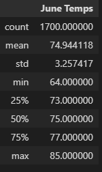
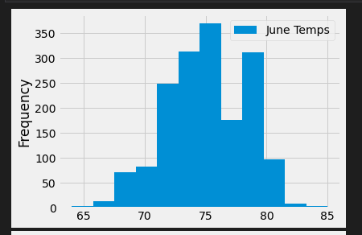
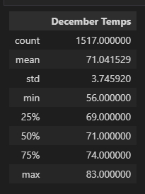
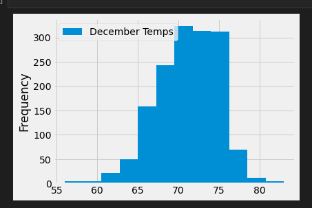

# Module-9-Challenge
# Overview of Project #
The purpose of this Project is to analyze the weather trends in **Oahu, Hawaii**. This data will be used to understand whether opening a Surf and Shake in Oahu will perform well. The Oahu shop serves surf boards and ice cream to tourists. If the shop in Oahu does well, they could expand to other islands. Specifically, summary statistics of temperature trends data has been requested for the months of June and December, in order to determine if the surf and ice cream shop business is sustainable year round.

The analysis consisted of the following:
1. The Summary Statistics for June Temps
2. The Summary Statistics for December Temps

# Results #
## Summary Statistics for June ##
The data gives summary statistics for the temperature trends in June form the Measurements table in the hawaii.sqlite database. 
The following depicts the June temps DataFrame:  
    

The average temperature recorded in June is about 75 degrees F and it is approximately 23 degrees c. It is clear with this analysis that June is one of the favourable month for the sustainability business of surfing and ice cream in the year. 

June Recorded Temps Visualization (Temperature and Frequency) 
    

## Summary Statistics for December ##
The data gives summary statistics for the temperature trends in December form the Measurements table in the hawaii.sqlite database. 
The following depicts the December temps DataFrame: 
    

The average temperature recorded in December is about 71 degrees F and it is approximately 22 degrees c. By this analysis,It is clear with that December is also favourable month for the sustainability business of surfing and ice cream in the year. We can analyze that Oahu is a great location for the new surf shop. 

December Recorded Temps Visualization (Temperature and Frequency) 
    
  
# Summary #
Based off of both the summary statistcs and the graph, you can see both June and December are suitable months temperature wise for the business. Other queries I would run to paint better picture are the summary statistics of all months, and then convert the averages across a graph with temperature on the y axis and months on the x axis.
